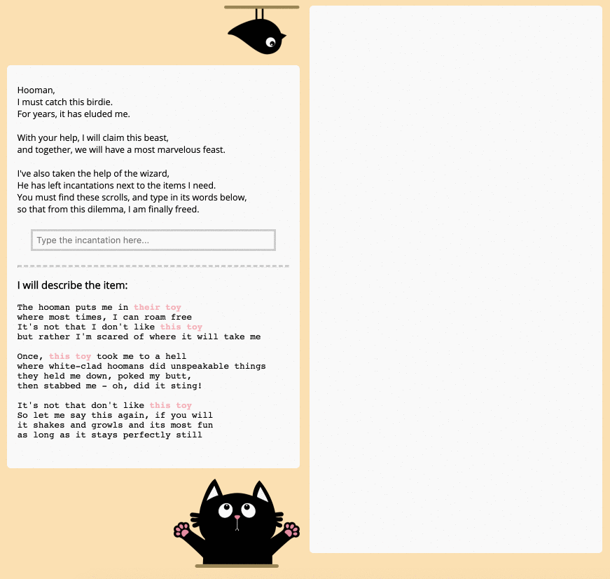

# Introduction

There's this tradition where I make a small game for my sister on her birthday every year. 

This year (2020), I made this tiny game for her. 

*There are sounds too which the above giphy can't really show.*

# Play around

Try it out yourself here: https://metalwihen.github.io/tmbday2020

This game isn't limited to the web app.

Once you figure out the item as described by the clue, you need to search for a paper scroll. This scroll is hidden somewhere near the actual item at home. For example, if the clue points to a fridge, the scroll will be in the freezer. 

Once you find the scroll, it will have the incantation you need to move on to the next round in the game. You need to type the words (incantation) from the scroll into the input field of the web app. 

## Answers

### Clue 1

**Item:** Car

**Context:** We take the cat to our vet in the car. She loves roaming inside the car but hates the vet. 

**Incantation:** `relworg a ton reknoh`

### Clue 2

**Item:** Fridge

**Context:** Our fridge stopped working - or rather it would work for a couple of hours every day. This was scary, especially since service centers are closed because of the coronavirus lockdown. 

**Incantation:** `elkcispop a em ekam`

### Clue 3

**Item:** Laptop

**Context:** Zoom calls from the perspective of a cat lying on the floor next to you. 

**Incantation:** `emag a yalp su tel`

### Clue 4

**Item:** Cat Food

**Context:** Our cat loves to hide - no matter how many times we call out for her. But if you shake the bottle with the cat food, she'll come running. 

**Incantation:** `muy muy`

### Clue 5

**Item:** Litter Box

**Context:** Our cat is still pretty much a baby. Still figuring out the basics - like how not to get poop on her tail. 

**Incantation:** `oop oop ihc ihc`

### Clue 6

**Item:** Boxing Bag

**Context:** I have a boxing bag at home. The cat likes to watch when I workout. 

**Incantation:** `kooh baj baj`
